# Website Bán Mỹ Phẩm PA Cosmetic
### Họ và tên sinh viên: [Nguyễn Thị Phương Anh - 22010079](https://github.com/phanhh122)
## 1. Giới thiệu
**PA Cosmetic** là một website thương mại điện tử được phát triển bằng **Laravel**, dành cho việc bán và quản lý các sản phẩm mỹ phẩm. Dự án được xây dựng nhằm mang đến một nền tảng dễ sử dụng để quản lý sản phẩm, khách hàng và đơn hàng.

### Các tính năng chính:
- Hiển thị danh sách sản phẩm theo danh mục.
- Quản lý giỏ hàng và thanh toán.
- Tìm kiếm và lọc sản phẩm.
- Trang quản trị để quản lý sản phẩm, danh mục, khách hàng và đơn hàng.
- Tích hợp trình soạn thảo văn bản **CKEditor** để chỉnh sửa nội dung sản phẩm.
- Giao diện quản trị chuyên nghiệp dựa trên **AdminLTE** của ColorlibHQ.

## 2. Hướng dẫn cài đặt
#### Bước 1: Clone dự án về máy
```bash
git clone https://github.com/phanhh122/WebBanHang.git
cd Cosmetic
```

#### Bước 2: Cài đặt các thư viện phụ thuộc
Đảm bảo bạn đã cài **Composer**, sau đó chạy:
```bash
composer install
npm install
```

#### Bước 3: Thiết lập biến môi trường
```
cp .env.example .env
php artisan key:generate
```

#### Bước 4: Cấu hình cơ sở dữ liệu
Chỉnh sửa file .env để khớp với cấu hình cơ sở dữ liệu trên máy của bạn.
Sau đó chạy Migration và Seed: 
Tạo các bảng trong cơ sở dữ liệu:
```bash
php artisan migrate --seed
```

#### Bước 5: Chạy ứng dụng
Khởi động server bằng lệnh:
```bash
php artisan serve
```

Mở trình duyệt và truy cập vào địa chỉ:
```
http://127.0.0.1:8000
```

## 3. Sơ đồ User Case 
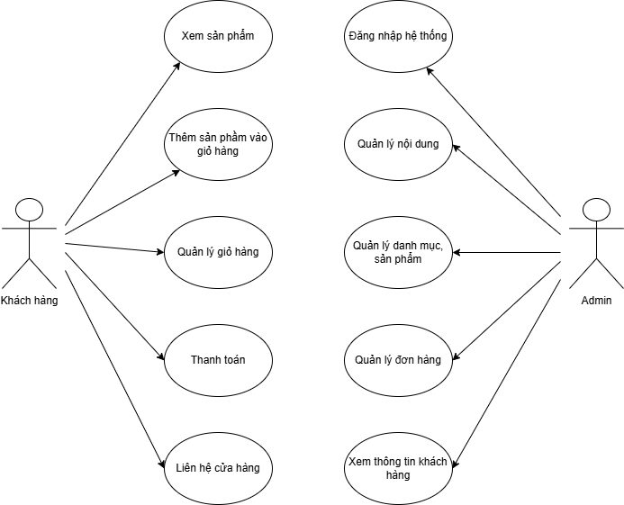
## 4. Cơ sở dữ liệu
Dự án sử dụng các bảng sau trong cơ sở dữ liệu:
1. **Users**: Quản lý tài khoản người dùng.
2. **Menus**: Danh mục sản phẩm.
3. **Products**: Thông tin sản phẩm (tên, giá, giảm giá, hình ảnh).
4. **Customers**: Thông tin khách hàng.
5. **Orders** và **Order_Items**: Quản lý đơn hàng và sản phẩm trong từng đơn.
6. **Carts**: Giỏ hàng tạm của khách hàng.
7. **Sliders**: Hình ảnh quảng cáo.
8. **Tags** và **Product_Tags**: Gắn thẻ sản phẩm.
9. **Settings**: Cấu hình chung của website.

### Sơ đồ cơ sở dữ liệu:


## 5. Giao diện Admin
### Đăng nhập
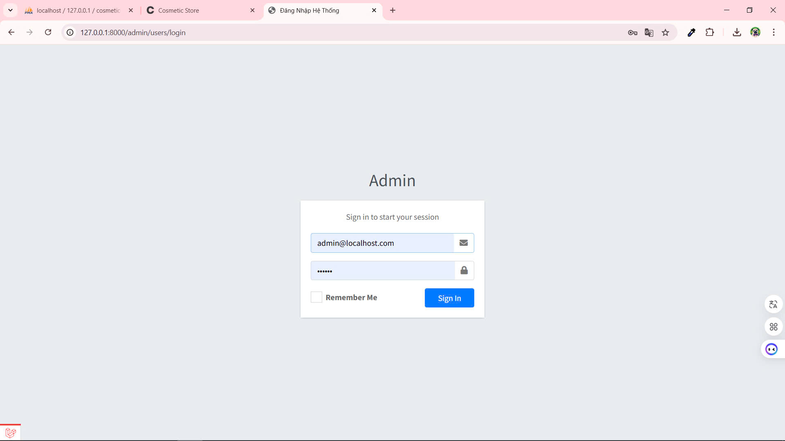
### Quản lý danh mục
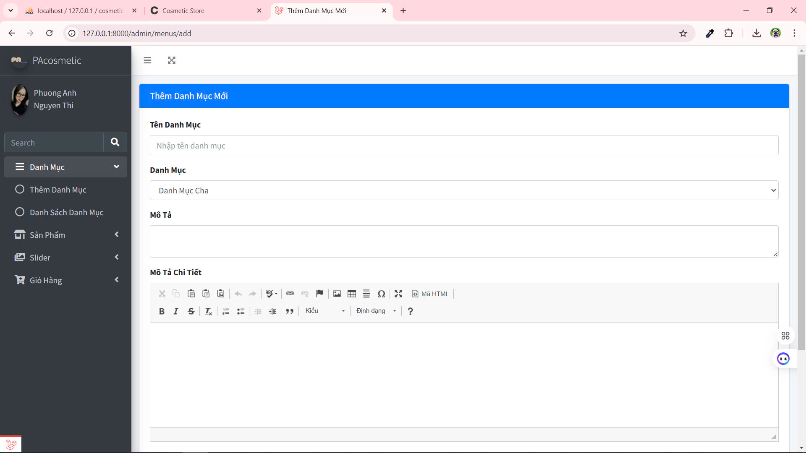
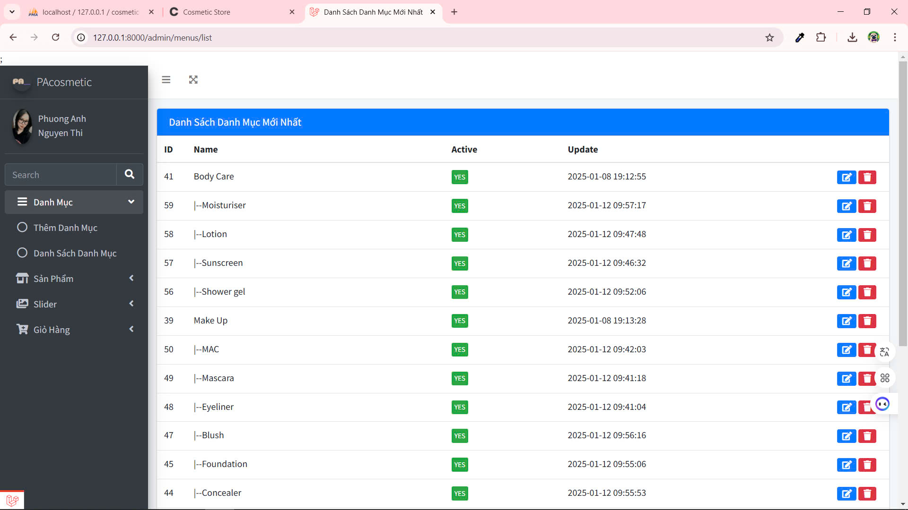
### Quản lý sản phẩm
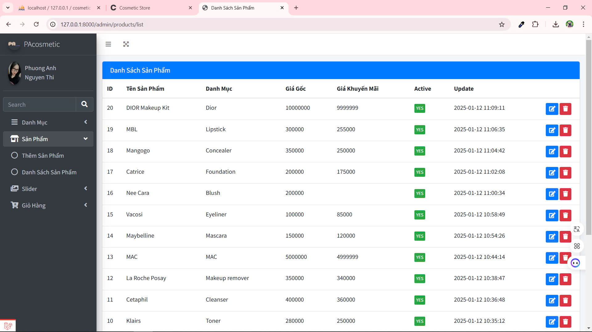
### Quản lý slider
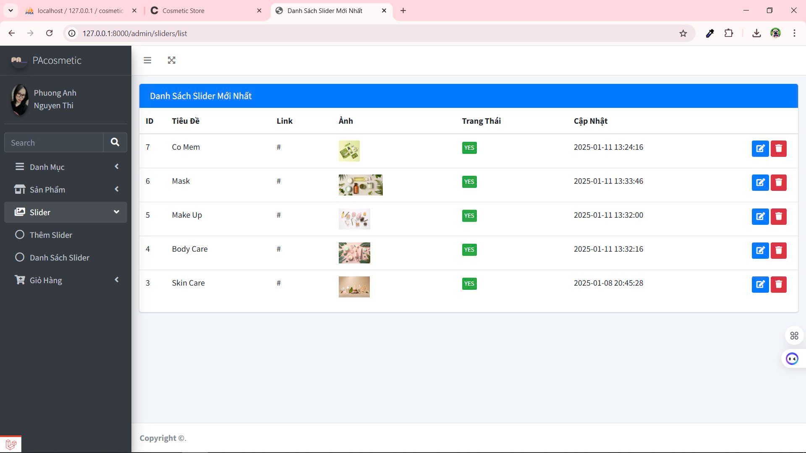
### Quản lý đơn hàng
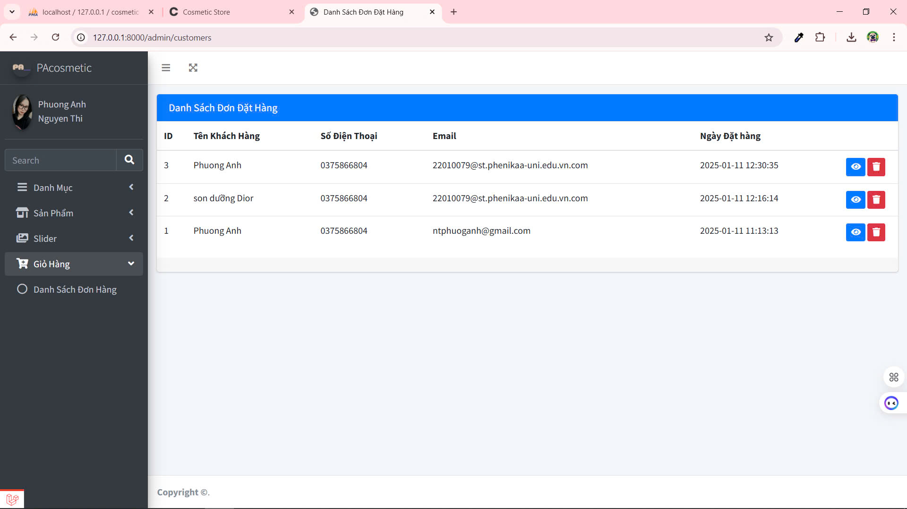
### Xem thông tin khách hàng
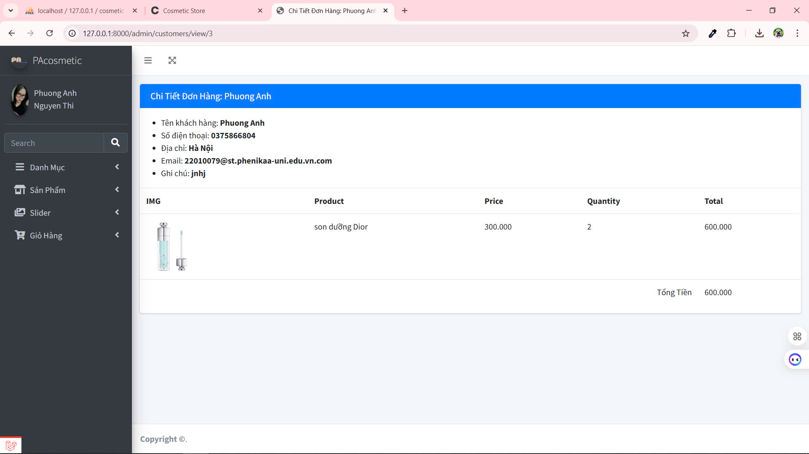
## 6. Giao diện Người dùng
### Trang chủ

### Xem sản phẩm
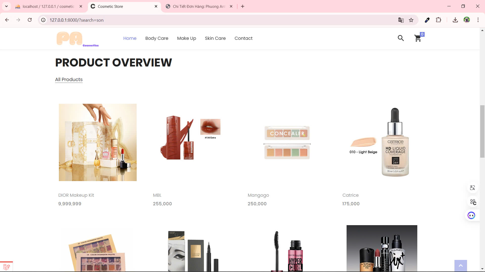
### Quản lý giỏ hàng và đặt hàng
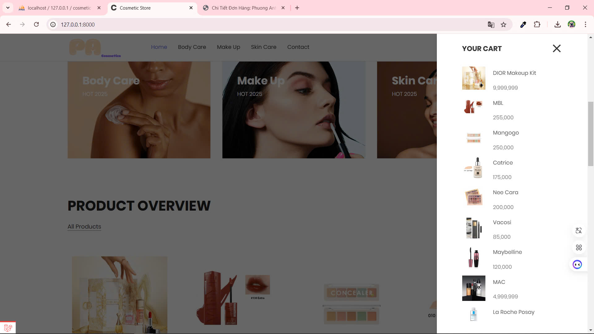
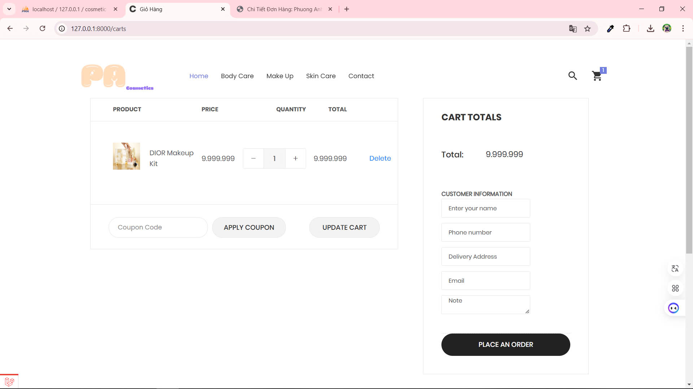
## 7. Ghi chú
- Dự án đang trong giai đoạn phát triển, bạn có thể đề xuất tính năng hoặc báo cáo lỗi thông qua **GitHub Issues**.
- Cải tiến tương lai:
  - Đăng ký, đăng nhập cho user
  - Tích hợp thanh toán online (Momo, VNPAY).
 
