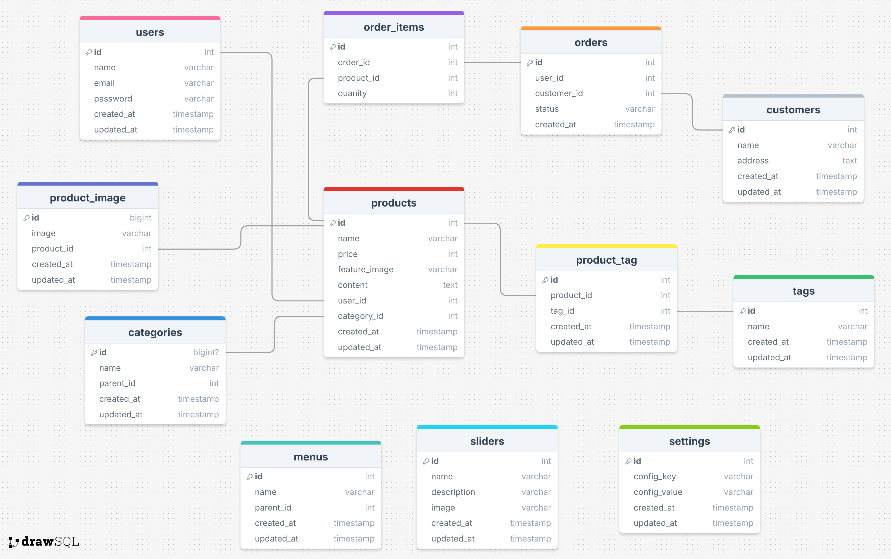

## README: PA Cosmetic - Website Bán Mỹ Phẩm

### 1. Giới thiệu
**PA Cosmetic** là một website thương mại điện tử được phát triển bằng **Laravel**, dành cho việc bán và quản lý các sản phẩm mỹ phẩm. Dự án được xây dựng nhằm mang đến một nền tảng dễ sử dụng để quản lý sản phẩm, khách hàng và đơn hàng.

#### Các tính năng chính:
- Hiển thị danh sách sản phẩm theo danh mục.
- Quản lý giỏ hàng và thanh toán.
- Tìm kiếm và lọc sản phẩm.
- Trang quản trị để quản lý sản phẩm, danh mục, khách hàng và đơn hàng.
- Tích hợp trình soạn thảo văn bản **CKEditor** để chỉnh sửa nội dung sản phẩm.
- Giao diện quản trị chuyên nghiệp dựa trên **AdminLTE** của ColorlibHQ.

### 2. Yêu cầu hệ thống
Để chạy dự án, cần đảm bảo hệ thống đáp ứng các yêu cầu sau:

#### Phần mềm:
- **XAMPP** (phiên bản >= 7.4): PHP, MySQL, Apache.
- **Composer** (trình quản lý gói PHP).
- **Visual Studio Code**

#### Công nghệ sử dụng:
- **Laravel Framework**: 9.x
- **MySQL**: Quản lý cơ sở dữ liệu.
- **HTML/CSS/JavaScript**: Giao diện người dùng.
- **CKEditor**: Trình soạn thảo nội dung sản phẩm.
- **AdminLTE**: Giao diện quản trị.

### 3. Hướng dẫn cài đặt
#### Bước 1: Clone dự án về máy
```bash
git clone https://github.com/phanhh122/WebBanHang.git
cd Cosmetic
```

#### Bước 2: Cài đặt các package PHP
Đảm bảo bạn đã cài **Composer**, sau đó chạy:
```bash
composer install
```

#### Bước 3: Cài đặt cơ sở dữ liệu
- Tạo một cơ sở dữ liệu mới trong **phpMyAdmin** (VD: `pa_cosmetic`).
- Chỉnh sửa file `.env` trong thư mục gốc để kết nối với database:
  ```env
  DB_CONNECTION=mysql
  DB_HOST=127.0.0.1
  DB_PORT=3306
  DB_DATABASE=pa_cosmetic
  DB_USERNAME=root
  DB_PASSWORD=
  ```

#### Bước 4: Chạy migration và seed dữ liệu
Tạo các bảng trong cơ sở dữ liệu:
```bash
php artisan migrate
```

Nếu có seed dữ liệu (tùy chọn), chạy:
```bash
php artisan db:seed
```

#### Bước 5: Cài đặt frontend (nếu có sử dụng npm)
Cài đặt các package cần thiết:
```bash
npm install
npm run dev
```

#### Bước 6: Chạy ứng dụng
Khởi động server bằng lệnh:
```bash
php artisan serve
```

Mở trình duyệt và truy cập vào địa chỉ:
```
http://127.0.0.1:8000
```

### 4. Sơ đồ User Case 
### 5. Cơ sở dữ liệu
Dự án sử dụng các bảng sau trong cơ sở dữ liệu:

1. **Users**: Quản lý tài khoản người dùng.
2. **Menus**: Danh mục sản phẩm.
3. **Products**: Thông tin sản phẩm (tên, giá, giảm giá, hình ảnh).
4. **Customers**: Thông tin khách hàng.
5. **Orders** và **Order_Items**: Quản lý đơn hàng và sản phẩm trong từng đơn.
6. **Carts**: Giỏ hàng tạm của khách hàng.
7. **Sliders**: Hình ảnh quảng cáo.
8. **Tags** và **Product_Tags**: Gắn thẻ sản phẩm.
9. **Settings**: Cấu hình chung của website.

#### Sơ đồ cơ sở dữ liệu:


### 6. Các tính năng chi tiết
#### Frontend:
- Hiển thị sản phẩm theo danh mục.
- Tìm kiếm và lọc sản phẩm.
- Quản lý giỏ hàng và thanh toán.

#### Backend:
- Quản lý sản phẩm (thêm, sửa, xóa) với giao diện dựa trên **AdminLTE**.
- Tích hợp **CKEditor** để chỉnh sửa nội dung sản phẩm dễ dàng.
- Quản lý khách hàng và đơn hàng.
- Cài đặt slider quảng cáo.

### 7. Triển khai trên môi trường sản xuất
#### Chuẩn bị hosting hoặc server:
- Cài đặt Apache hoặc Nginx.
- Đảm bảo PHP và MySQL đã được cài đặt.

#### Bước triển khai:
1. **Upload code lên server**.
2. Chạy `composer install` để cài đặt package.
3. Cấu hình file `.env` cho kết nối cơ sở dữ liệu.
4. Chạy `php artisan migrate --force` để tạo bảng.
5. Sử dụng **Laravel Scheduler** nếu có các tác vụ tự động.

### 8. Tích hợp CKEditor
- **CKEditor** được sử dụng để chỉnh sửa nội dung chi tiết sản phẩm.
- Các file CSS và JS cần được tích hợp trong form chỉnh sửa sản phẩm.

### 9. Giao diện Admin với AdminLTE
- **AdminLTE** được sử dụng để xây dựng giao diện quản trị.
- Bao gồm các module:
  - Dashboard: Thống kê doanh thu và sản phẩm.
  - Quản lý sản phẩm, khách hàng, đơn hàng.
  - Slider quảng cáo và cài đặt cấu hình.

### 10. Contributors: Nguyễn Thị Phương Anh
- Liên hệ: [ntphuoganh@gmail.com] / [0375866804].

### 11. Giao diện Admin
#### Đăng nhập
#### Quản lý danh mục
#### Quản lý sản phẩm
#### Quản lý slider
#### Quản lý đơn hàng
### 12. Giao diện Người dùng
#### Xem sản phẩm
#### Quản lý giỏ hàng và đặt hànghàng

### 13. Ghi chú
- Dự án đang trong giai đoạn phát triển, bạn có thể đề xuất tính năng hoặc báo cáo lỗi thông qua **GitHub Issues**.
- Cải tiến tương lai:
  - Tích hợp thanh toán online (VD: Momo, VNPAY).
  - Hỗ trợ đa ngôn ngữ.
  - Thêm API cho mobile app.
